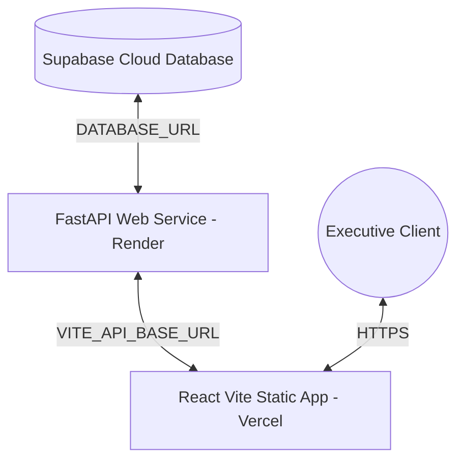

# Code Blue: Emergency Operations & Patient Flow Analytics
## Master Project Documentation & Specification

Welcome to the comprehensive technical documentation for **Code Blue**—a high-density, interactive clinical operations dashboard designed for healthcare executives, clinicians, and CFOs. 

This project integrates a FastAPI database aggregation engine with a modern React client to tell a cohesive story about patient flow bottlenecks, staff burnout, and financial sustainability across 11 hospital facilities.

---

## 💻 Technical Stack Overview

### 1. Frontend Client
- **Framework**: React v18 (built with Vite for high-performance development and optimized production bundling).
- **Styling**: Vanilla CSS and Tailwind CSS classes configured with a solid, high-contrast dark theme.
- **Data Visualization**:
  - **Recharts**: powering the Area, Bar, Scatter, Radar, Bubble, and Line charts.
  - **D3 (Data-Driven Documents)**: powering the custom patient flow Sankey diagram (`d3-sankey`).
  - **React Calendar Heatmap**: daily patient visit counts calendar grid.
  - **React Simple Maps**: geo-spatial regional mapping of readmission rates.
- **Icons**: Lucide React.
- **Routing**: Client-side single-page app (SPA) tabs.

### 2. Backend API
- **Framework**: FastAPI (Asynchronous Python framework).
- **Database Connection**: SQLAlchemy with `QueuePool` connection pooling for safe, concurrent database queries.
- **Environment**: Python Dotenv (`python-dotenv`) for local environment loading.

### 3. Database Layer
- **Engine**: Supabase Cloud PostgreSQL.
- **Hosting**: AWS (Singapore region).
- **Data Model**: Relational star schema.

---

## 🔄 Data Migration & ETL Pipeline

We designed and built a specialized Python-based ETL (Extract, Transform, Load) pipeline ([migration_script.py](file:///d:/SideProjects/Heathcarte%20Analytics%20FP20/hospital-flow-analytics/backend/migration_script.py)) to ingest data from the audited Excel source document (`Code Blue — Emergency Operations & Patient Flow Analytics_C38.xlsx`) into the Supabase cloud cluster:

1. **Extraction & Parsing**: Uses `pandas` to open and parse the Excel workbooks, converting individual tabs into data frames.
2. **Transformations & Cleansing**:
   - Sanitizes raw spreadsheet column headers (removes special characters, slashes, spaces) into standardized PostgreSQL-compliant `snake_case` attributes.
   - Handles date format casting and handles missing values (`COALESCE` formatting) on dimensions.
   - Splits denormalized Excel metrics into clean transactional dimensions and facts to enforce relational boundaries.
3. **PostgreSQL Loading & Optimizations**:
   - Leverages SQLAlchemy engine transactions to push tables into Supabase.
   - Executes SQL statements to configure Primary Keys (PKs) and Foreign Keys (FKs).
   - Generates indexes on frequently queried search vectors (like `(hospital_id, shift_date)`) to guarantee sub-second performance on server-side filters.

---

## 🗄️ Relational Database Schema

The database is structured to separate dimensional attributes from high-density transactional fact records:

### 1. Dimension Tables
- **`dim_hospital`**: Contains details of the 11 facilities.
  - `hospital_id` (PK)
  - `hospital_name`
  - `nhs_trust_type` (NHS Trust vs. Private)
  - `region_id` (FK)
  - `total_beds`
  - `icu_beds`
- **`dim_region`**: Holds geographic boundaries for UK regions.
  - `region_id` (PK)
  - `region_name`
- **`dim_department`**: Lists clinical departments.
  - `department_id` (PK)
  - `department_name`
- **`dim_date`**: Calendar lookup table.
  - `full_date` (PK)
  - `day_of_week`
  - `month_name`

### 2. Transactional Fact Tables
- **`fact_patient_visits`**: High-frequency patient entry ledger.
  - `visit_id` (PK)
  - `hospital_id` (FK)
  - `department_id` (FK)
  - `arrival_datetime`
  - `wait_time_minutes`
  - `readmission_30_days_flag` (Boolean)
  - `severity_level` (1 to 5)
  - `outcome` (Admitted, Discharged, Left AMA)
- **`fact_staffing`**: Monthly workforce capacity and overtime stress records.
  - `shift_id` (PK)
  - `hospital_id` (FK)
  - `department_id` (FK)
  - `month` (1-12)
  - `staff_absence_count`
  - `overtime_hours`
  - `burnout_risk_index` (Decimal)
- **`fact_financials`**: Monthly institutional expenditures.
  - `financial_id` (PK)
  - `hospital_id` (FK)
  - `month` (1-12)
  - `revenue`
  - `operational_cost`
  - `staffing_cost`
  - `overtime_premium_cost`
  - `profit_margin`

---

## 🔌 API Route catalog (`/api/v1`)

All endpoints are built using SQLAlchemy core raw queries to guarantee maximum speed by avoiding heavy ORM overhead. Every route accepts `region`, `trust_type`, and `hospital_id` parameters to support server-side global filtering.

| Endpoint | Method | Response Shape | Primary UI Consumer |
| :--- | :--- | :--- | :--- |
| `/overview/kpis` | `GET` | `{ total_visits: int, readmission_rate: float, ... }` | Sticky Filter Ribbon Counters |
| `/overview/visits-over-time` | `GET` | `[ { month: str, visits: int } ]` | Monthly Patient Volume Area Chart |
| `/overview/visits-treemap` | `GET` | `[ { name: Hospital, children: [ { name: Dept, value: int } ] } ]` | Department Capacity Treemap |
| `/overview/daily-heatmap` | `GET` | `[ { date: str, count: int } ]` | Calendar Heatmap Widget |
| `/overview/hourly-arrivals` | `GET` | `[ { hour: int, count: int } ]` | Polar Hourly Arrivals Ring |
| `/hospitals/outliers` | `GET` | `[ { hospital_id: str, readmission_rate: float, ... } ]` | YoY Scatter Plot Coordinates |
| `/hospitals/bump-rankings` | `GET` | `[ { month: int, hospital_name: str, rank: int } ]` | Monthly Readmission Bump Chart |
| `/hospitals/{id}/sankey-flow` | `GET` | `{ nodes: [...], links: [...] }` | D3 Patient Flow Path Diagram |
| `/hospitals/{id}/severity-weekday-wait` | `GET` | `[ { severity: int, weekday: str, avg_wait: float } ]` | Severity wait times Heatmap Grid |
| `/analytics/radar-profiles` | `GET` | `[ { subject: str, NHS: float, Private: float } ]` | Dual Sector Profile Radar |
| `/analytics/diverging-wait` | `GET` | `[ { hospital_name: str, divergence: float } ]` | Diverging Wait Comparison Chart |
| `/analytics/regional-choropleth` | `GET` | `[ { region_id: str, region_name: str, ... } ]` | UK Regional Choropleth Maps |
| `/analytics/burnout-financials` | `GET` | `[ { hospital_name: str, avg_burnout: float, ... } ]` | Burnout vs Margin Bubble Chart |
| `/analytics/financial-waterfall` | `GET` | `[ { name: str, value: float } ]` | Cost Deficit Waterfall Bridge |
| `/analytics/absences-overtime` | `GET` | `[ { month: int, absences: int, overtime: float } ]` | Overtime vs Absences Combo Chart |
| `/analytics/satisfaction-burnout-slope` | `GET` | `[ { hospital_id: str, month: int, burnout: float } ]` | 12-Month Burnout Trend Line Chart |
| `/analytics/cfo-alerts` | `GET` | `[ { hospital_id: str, type: str, message: str } ]` | Dynamic Recommendation Panel |

---

## 🎨 Dashboard Page Specifications

### Page 1: System Health & Overview
- **Key Insight**: Monitors standard physical and capacity metrics across the entire country. Shows winter-month patient surges and night-shift arrivals.
- **Layout Widgets**:
  - *Area Chart*: Visualizes visits over time.
  - *Treemap*: Maps hierarchical division of department volumes.
  - *Daily Heatmap*: Displays daily visit intensity to reveal holiday spikes.
  - *Polar Clock*: Visualizes arrivals by hour.

### Page 2: YoY Trajectory Shift
- **Key Insight**: Re-focuses the narrative from a single "Sandwell H07 Crisis" to the chronological performance shift between H1 and H2.
- **Layout Widgets**:
  - *Interactive YoY Slider*: Animate bubbles representing hospitals over the year.
  - *High-Density Scatter Plot*: Plots Readmissions vs. Staff Stress with quadrant targets.
  - *Sankey Diagram*: Maps patient path logic (`Admission Type ➔ Severity ➔ Outcome`).
  - *Severity Heatmap*: Pinpoints day/severity combinations causing wait bottlenecks.

### Page 3: Sector Divide Paradox
- **Key Insight**: Debunks the private healthcare efficiency myth. Shows that Private facilities (like H02 Nuffield) maintain low stress yet suffer from some of the highest wait times.
- **Layout Widgets**:
  - *6-Axis Radar Chart*: Compares NHS vs. Private averages across key metrics.
  - *Diverging Bar Chart*: Highlights waiting times relative to the global average.
  - *Choropleth Map*: Color-coded regional performance distribution.
  - *Reference Table*: Sortable comparison ledger of beds, margins, and stress indices.

### Page 4: Burnout & Financial Squeeze
- **Key Insight**: Focuses on systemic staffing strain. Highlights **Bristol Royal (H11)** as a worst-case outlier operating with a critical burnout index and the only negative profit margin in the network.
- **Layout Widgets**:
  - *Deficit Highlight Banner*: Red-themed banner warning board members about H11's deficit.
  - *Bubble Chart*: Grouped burnout risk vs. profit margins.
  - *Waterfall Chart*: Revenue to net margin step-down bridge (subtracts staffing, ops, and ICU costs cleanly).
  - *Combo Trend Chart*: Correlates monthly absence counts with overtime hours.
  - *12-Month Line Chart*: Traces monthly burnout trends. Standard lines are dimmed (`opacity: 0.3`, `dots: hidden`) to highlight Bristol's red trajectory.
  - *Dynamic Alerts Panel*: Context-aware warning alerts based on database thresholds.

---

## 🚀 Cloud Deployment Architecture

The application is structured to be deployed independently to simplify continuous integration and hosting:

### 1. Frontend Setup (Vercel)
- **Vercel Settings**:
  - **Framework Preset**: `Vite`
  - **Root Directory**: `frontend`
  - **Build Command**: `npm run build`
  - **Output Directory**: `dist`
- **SPA Rewrites (`vercel.json`)**: Configured to route all client-side URL queries to `/index.html` to prevent `404` errors on sub-page refreshes.
- **Environment Settings**: Add `VITE_API_BASE_URL` pointing to your deployed backend URL.

### 2. Backend Setup (Render)
- **Render Settings**:
  - **Environment**: `Docker` (automatically builds from our [Dockerfile](file:///d:/SideProjects/Heathcarte%20Analytics%20FP20/hospital-flow-analytics/backend/Dockerfile)).
  - **Root Directory**: `backend`
- **Environment Settings**: Add `DATABASE_URL` pointing to your Supabase PostgreSQL cluster.

### 3. Credentials & GitIgnore Setup
- **Root `.gitignore`**: Excludes `.env`, `.env.production`, and build assets.
- **Credentials Untracking**: Both `backend/.env` (Supabase URL) and `frontend/.env.production` are untracked from Git (`git rm --cached`) to safeguard database credentials.
